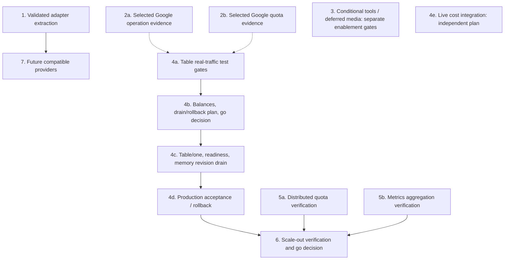

# Recommended Implementation Order

**Planned** roadmap, revised 2026-10-08 following review. Individual statuses below
separate implemented code, observed live behavior, and remaining gates.

The numbered workstreams are priorities and deployment milestones, not strictly sequential
tiers. Independent implementation and planning can proceed in parallel. Live execution and
production changes require their own bounded plans, evidence and go decisions; this roadmap
does not authorize them.

## 1. OpenAI-compatible adapter extraction

- **Status:** **Implemented**. The [extraction plan](../openai-compatible-adapter/index.md)
  passed local verification after independent plan review; see its [evidence](../openai-compatible-adapter/evidence.md).
- **Purpose:** A refactor intended to preserve behavior. Pre-extraction characterization
  fixtures passed unchanged after extraction, alongside the full suite, strict typing and
  Docker checks. This establishes local compatibility for the recorded cases; live provider
  enablement remains separately gated.
- **Dependency:** Enables workstream 7 and can simplify later adapter changes. Existing
  Google live verification does not require extraction.

## 2. Required now: text routing and remaining live verification

Follow the [completion audit's delivery triage](../google-ai-studio-tools-multimodal/completion-audit.md):
modern-model text and streaming, project/model quota routing and exclusion, thought-inclusive
settlement, and request/usage cleanup take priority. The 2.5 text track retains its budget-0
path. Media is deferred; tools and signed continuation are conditional on coding-agent needs.

### 2a. Reconcile evidence and close exact operation gaps

The [text verification matrix](text-verification-matrix.md) reconciles all twenty selected
project/model combinations, historical router counts, newer direct/router failures and
remaining operation/accounting gates. Reconciliation and a [fresh native stage](native-text-results-2026-10-08.json) are recorded:
3.5 Flash-Lite passed nonstreaming/streaming on all five keys; 3.8 Flash failed all five
nonstreaming cases. Remaining live/accounting/production gates stay partial.

**Partially implemented**. The [live runner evidence](../google-ai-studio-tools-multimodal/live-runner/evidence.md)
and [capacity inventory](../google-ai-studio-capacity-inventory/index.md) record native
nonstreaming and streaming attempts using existing credentials. Native 3.5 Flash-Lite passed
on all five project labels; 3.8 Flash streaming had substantial failures. Native 2.5
nonstreaming passed on projects 1–2 and returned 404 on projects 3–5. These dated observations
establish neither general availability nor production readiness.

Compatibility-surface Responses and embeddings remain unverified. Track provider
failure/admission behavior through the router separately from direct quota probes. Local
combination exclusion is implemented with synthetic verification; live nonzero thinking-token
settlement remains unproven. Record model, project, surface, operation, streaming mode, usage
and outcome for each required case, preserving failures and unknowns.

Reuse existing credential handling without exposing keys. Check applicable authorization
and remaining finite request/token/spend budgets before further execution; historical results
do not establish a fresh budget. Verify operations needed by the intended rollout: unrelated
embeddings or media cases do not block a text-only rollout, and native text evidence does not
clear compatibility or media gates.

### 2b. Complete capacity evidence for selected production combinations

**Partially implemented**. The inventory records 310 historical/current project/model
combinations; 24 buckets have provider-confirmed RPM and input TPM, and 19 of those have RPD.
Remaining work includes:

- Five missing RPD values within those 24 buckets and other unknown quotas, including the
  historically tested 3.5 Flash-Lite and 3.8 Flash combinations.
- Actual project IDs and independent tier evidence (the operator reconfirmed all five free-tier), projects 3–5 access investigation for
  2.5 Flash/Lite, and cross-model/alias shared-limit confirmation.

Unknown values are neither zero nor unlimited. This work runs independently of extraction
and verification code. Production quota configuration needs reviewed evidence and explicit
eligibility for selected Google combinations, not completion of every catalog row. Keep
inaccessible or unverified combinations excluded as required by the rollout plan.

## 3. Conditional tools and deferred media

This workstream is not a prerequisite for the required text track. Each feature needs its
own exact-model/client evidence, accounting bounds and approval before enablement. Basic text
success alone clears none of these gates.

### 3a. Native media and PDF

Native text has the live observations described in 2a. The
[native/PDF local gates](../google-ai-studio-tools-multimodal/native-pdf/evidence.md) passed,
but PDF remains **Partially implemented**, with exact-model pricing and live enablement
gates outstanding. PDF/image work remains deferred under the delivery triage.

### 3b. Function tools and signed continuation

Conditional on coding-agent requirements. Signed continuation is **Partially implemented**:
[independently reviewed code](../google-ai-studio-tools-multimodal/signed-continuation/evidence.md)
covers codec, keys, binding, history, routing, HTTP/client integration and lifecycle cases
behind a startup gate. Remaining enablement work includes public extension/schema approval,
exact-client tool/continuation round trips, maximum combined resource/lifecycle checks and
exact-model live evidence. Maximum signed-history benchmarks remain deferred until needed.
Opening signed continuation alone does not open WAV/AVI input.

### 3c. Generated image and audio output

Both are **Partially implemented** behind unconditional startup gates, with reviewed local
integration and resource evidence. Exact-model live gates remain; generated-image live
verification also needs its paid execution budget. See
[image evidence](../google-ai-studio-tools-multimodal/generated-image/evidence.md) and
[audio evidence](../google-ai-studio-tools-multimodal/generated-audio/evidence.md).
Both directions remain deferred.

### 3d. Audio/video input

Finite PCM WAV and raw DIB AVI input are **Partially implemented**, with local SDK, routing,
settlement and individual resource checks. Combined media/state resource, cancellation,
final quality and exact-model codec/pricing/quota/live gates remain as recorded in the
[audio](../google-ai-studio-tools-multimodal/audio-input/evidence.md) and
[video](../google-ai-studio-tools-multimodal/video-input/evidence.md) evidence. Both remain deferred.

## 4. Production cut-over and independent cost reconciliation

Production remains `stateBackend: memory` with `maxReplicas: 1` until the pre-cut-over gates
pass and a go decision is recorded. Table adapters are **Implemented** and synthetically
verified with one/two replicas and existing-account cross-RG attachment. That evidence does
not establish Table-backed real inference. Follow the existing
[operations guidance](../../operations/index.md),
[shared-credit migration guidance](../../operations/shared-resource-credit.md) and
[infrastructure guide](../../../infra/README.md).

### 4a. Pre-cut-over verification in the test topology

Verify Table-backed real nonstreaming/streaming inference, usage settlement, reservation
cleanup and provider failure/admission behavior for the intended deployment. Record exact
scope and failures. Close fs-openclaw inference/provider gaps with bounded verification
before admitting that backend to the cut-over scope. For Google inclusion, require selected
operation evidence and quota configuration from 2a/2b. Google catalog completion and deferred
media do not block a separately scoped Azure-only cut-over.

### 4b. Recorded go decision and balances

After pre-cut-over verification, prepare reconciled starting estimates, the concrete
deployment/drain procedure and rollback configuration, and record the go decision.
In-memory spend and reservations are not migrated. Local estimates must stay labeled as
estimates, not authoritative Azure balances. Preserve configured ingress restrictions.

### 4c. Table deployment at one replica

Deploy the approved Table configuration with `maxReplicas: 1`, require green readiness,
and complete the planned drain so no memory-backed revision remains active or receives
traffic. Verify revision state explicitly; single-revision configuration alone does not
prove that an overlap never occurred. This is the controlled transition after 4a/4b,
not permission to scale out.

### 4d. Production verification and rollback gate

Verify bounded real traffic, exact backend attribution including fs-openclaw if enabled,
usage debits, reservation cleanup and provider failure handling through the production
topology. On a failed acceptance gate, use the documented rollback to memory/one with fresh
estimates and pinned configuration; retain Table data and do not reactivate stale memory
state. Successful verification completes cut-over; scale-out remains gated.

### 4e. Live cost reconciliation adapter — independent implementation

**Planned**. Add live Azure Cost Management integration under a separate reviewed plan,
building on the [existing reconciliation boundary](../../operations/shared-resource-credit.md).
Define stale-data behavior and preserve labeled estimates when authoritative data is
unavailable. This work can proceed before cut-over and does not block quota or metrics
implementation. Cut-over still requires reconciled starting estimates; implementing this
adapter is not a substitute for that operational gate.

## 5. Distributed quota and metrics — independent engineering workstreams

### 5a. Distributed quota accounting

**Implemented** locally under the independently reviewed
[quota plan](../distributed-quota-accounting/index.md). Opt-in Table quota enforces full
shared group limits; default memory state retains per-replica shares. Atomic fake-client
and real Azurite tests passed. Deployed multi-replica provider admission remains unverified.
Preserve quota/credit separation, project grouping, reservation settlement, bounded failure
handling and rollout-overlap accounting. Choose storage only against concrete requirements.
Implementation and isolated verification do not depend on production cut-over or live cost
integration.

### 5b. Multi-worker and multi-replica metrics aggregation

**Planned**. Design and verify aggregation independently of 5a. Distinguish processes within
a replica from separate replicas: Prometheus multiprocess file storage alone does not
aggregate separate Container App replicas. Specify per-replica collection and central
aggregation, or an appropriate OpenTelemetry pipeline, and verify totals and restart behavior.

## 6. Scale-out deployment gate

**Planned**. Lift `maxReplicas: 1` only after 4d succeeds and quota admission plus metrics
aggregation from 5a/5b pass isolated multi-replica verification. Include real provider
admission, concurrent reservations/settlement, failure handling, restart and rollout overlap
in the acceptance evidence. Recheck readiness/effective quota shares for the proposed count.
Record a separate scale-out go decision and rollback; existing synthetic Table evidence
alone does not clear this gate.

## 7. Future OpenAI-compatible providers

**Implemented** locally, explicitly separate from extraction. The configurable
`openai_compatible` provider passed independent plan and implementation review, mocked
Responses/streaming/embeddings and mixed-pool lifecycle verification; see its
[contract and evidence](../openai-compatible-provider/index.md). Exact upstream/model live
compatibility remains unverified.
It depends on the validated generic adapter from workstream 1, not on completion of media,
production cut-over or scale-out.

## Dependency map

Solid arrows are implementation or deployment prerequisites. Dotted arrows are conditional
Google rollout prerequisites. Independent workstreams have no artificial sequencing edges.

## Next actions

Adapter extraction and text evidence reconciliation are locally complete. The fresh native
stage is recorded; next close scoped compatibility/accounting gates and implement independently
reviewed workstreams. Capacity investigation, Table test planning, distributed quota,
metrics and cost-integration planning can proceed independently. Each implementation still
follows the repository's template, independent review and verification workflow. Preserve
the text-first priority and all production/startup gates while that work proceeds.

## Phase transitions

| Phase | Status | Evidence |
| --- | --- | --- |
| Current-state checkpoint | Committed `deb05a5` | Reviewed extraction and revised roadmap |
| Pre-extraction characterization | Committed `06a6b80` | 21 immutable synthetic wire scenarios, verified before extraction |
| Adapter extraction | Committed `3001929` | [Evidence](../openai-compatible-adapter/evidence.md): full suite, coverage, typing, local Azurite, Python 3.12 Docker smoke and implementation review |
| Text evidence reconciliation | Complete locally; live verification **Partially implemented** | [Exact-combination matrix](text-verification-matrix.md); no provider traffic or production configuration change |
| Native text follow-up | Committed `66175af`; live verification **Partially implemented** | Fifteen dispatches, ten 3.5 passes/five 3.8 failures; [retained ledger](ledger-native-text-2026-10-08.json), no overrun or production change |

| Compatible provider implementation | Committed `566e404`; complete locally; live compatibility unverified | [Evidence](../openai-compatible-provider/evidence.md); exact-root Bearer transport, independent bounded text, mixed pools and conservative stream settlement |

| Distributed quota implementation | Complete locally; deployed admission unverified | [Evidence](../distributed-quota-accounting/evidence.md); bounded shared counters, durable attempt IDs, conservative cancellation, real Azurite verification; production unchanged |
